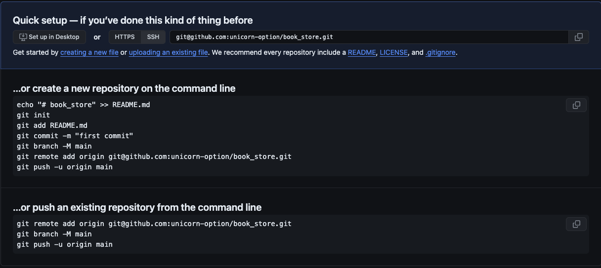
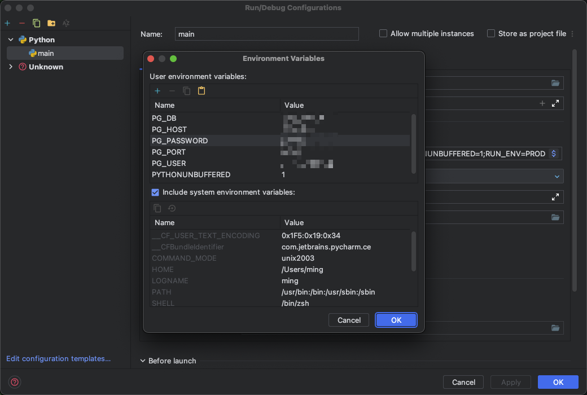

# Book Store

## Quick Setup -- If You've Done This Kind of Thing Before

- Clone with HTTPS [https://github.com/unicorn-option/book_store.git](https://github.com/unicorn-option/book_store.git)
- Clone with SSH [git@github.com:unicorn-option/book_store.git](git@github.com:unicorn-option/book_store.git)

## ...or Create A New Repository on the Command Line

```bash
$ echo "# Book Store" >> README.md
$ git init
$ git add README.md
$ git commit -m "add README file"
$ git branch -M main
$ git remote add origin https://github.com/unicorn-option/book_store.git
$ git push -u origin main
```

## ...or Push An Existing Repository from the Command Line

```bash
$ git remote add origin git@github.com:unicorn-option/book_store.git
$ git branch -M main
$ git push -u origin main
```



## Create Dependent Environment 创建依赖环境

1. 创建虚拟环境并激活
   1. Python3 venv 模块
      ```bash
      $ python3 -m venv fastapi_env
      $ source ./fastapi/bin/activate
      ```
      - Conda (Anaconda or Miniconda)
         ```bash
         $ conda create -n fastapi_ven python=3.10
         $ conda activa fastapi_env
         ```
2. 安装依赖
   ```bash
   (fastapi_env) $ pip install -r requirements.txt
   ```
3. 搭建数据库
   - 官方下载 postgres 和 redis 的安装包安装
   - Docker 镜像容器
      ```bash
     $ docker run -d --name postgres -e POSTGRES_PASSWORD='your_pg_password' -e POSTGRES_USER='your_pg_user' -e ALLOW_IP_RANGE=0.0.0.0/0 -p 5432:5432 pg_container_name
     $ docker run -d --name my_redis -p your_redis_port:6379 redis:latest --requirepass your_redis_password
      ```
4. 数据库连接配置写入环境变量
   - 变量表

   | name           | value                       |
   |:---------------|:----------------------------|
   | PG_DB          | your_pg_db_name             |
   | PG_HOST        | your_pg_host                |
   | PG_PASSWORD    | your_pg_password            |
   | PG_PORT        | your_pg_port                |
   | PG_USER        | your_pg_user                |
   | REDIS_DB       | your_redis_db_index         |
   | REDIS_HOST     | your_redis_host             |
   | REDIS_PASSWORD | your_redis_password         |
   | REDIS_PORT     | your_redis_port             |
   | RUN_ENV        | your_env_tag: PROD、TEST、DEV |

   - PyCharm
     编辑 Configurations
     
   - conda 虚拟环境
      ```bash
      (fastapi_env) $ conda env config vars set PG_DB=your_pg_db_name PG_HOST=your_pg_host PG_PASSWORD=your_pg_password PG_PORT=your_pg_port PG_USER=your_pg_user REDIS_DB=0 REDIS_HOST=localhost REDIS_PASSWORD=unicorn REDIS_PORT=6379 RUN_ENV=your_env_tag -n fastapi_env
      ```
5. 生成数据库迁移和执行迁移
   ```bash
   # 初始化数据库, 只需执行一次, 把 /migrations 目录删除后可以重新初始化数据库
   (fastapi_env) $ aerich init-db
   # 生成迁移, 执行 init-db 命令时会同时生成迁移和执行迁移, 后续有新增活或修改表模型时才执行后面生成迁移和执行迁移的两个命令
   (fastapi_env) $ aerich migrate
   # 执行迁移, 即之前前一步生成的 SQL 语句在数据库中生成对应的表
   (fastapi_env) $ aerich upgrade
   ```
6. 启动服务
   运行 main.py 文件
   ```bash
   (fastapi_env) $ python main.py
   ```
   uvicorn 命令
   ```bash
   (fastapi_env) $ uvicorn main:app --host=127.0.0.1 --port=8000 --reload
   ```
